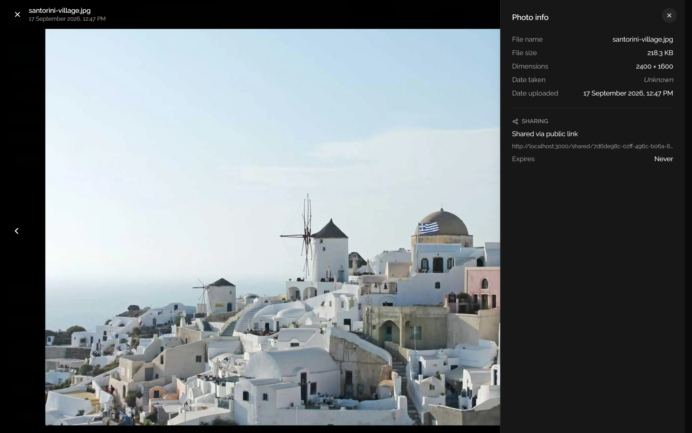
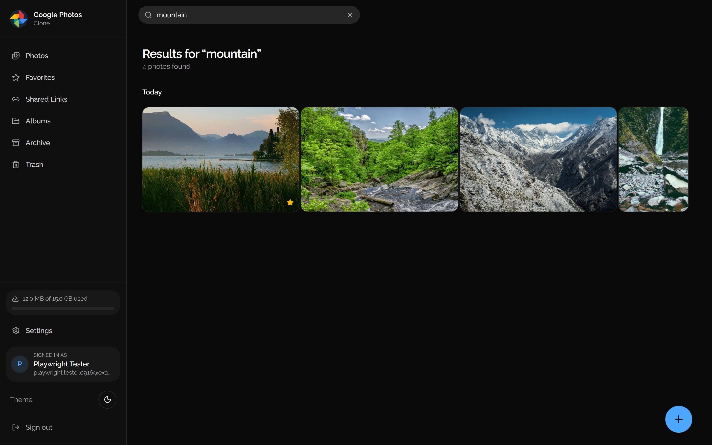

# 📸 Google Photos Clone

A full-featured Google Photos clone built with **Spring Boot 4.1** and **Next.js 16**: Google OAuth2 sign-in, EXIF metadata extraction, a justified photo grid, drag-and-drop uploads, public share links, **Google Gemini** captions, tags, semantic search and smart album suggestions, ImageKit-powered edits, fluid animations and a WCAG-audited dark mode.

<p align="center">
  
  
</p>

---

## ✨ Features

### Core
- **Photo library**: upload, star, archive, trash, restore and permanently delete, with bulk selection for every action
- **Justified grid**: rows that fill the full width while preserving each photo's aspect ratio, grouped by day, with infinite scroll
- **Albums**: create albums, add or remove photos, and pick a cover photo
- **Search**: case-insensitive search across file names, AI captions and AI tags
- **Favorites**: star photos from the grid or the viewer and browse them on their own page

### AI features (Google Gemini, optional)
- **Auto-tagging**: every upload gets a one-sentence caption, 5–15 tags, a scene type and its dominant colors, analyzed in the background after the upload finishes
- **Semantic search**: "beach" finds photos tagged beach whatever their file names; turn on **AI Search** and Gemini ranks descriptive queries like "sunset over the sea" by relevance, using captions and tags only
- **Search suggestions**: "Try" chips built from your most common tags
- **Describe an edit**: type "make it look vintage" or tap an example; Gemini suggests how, the app maps it to instant ImageKit transformations, and you get a before/after preview to save as a new photo
- **Smart album suggestions**: albums proposed from shared scenes, shared tags (5+ photos) and bursts of 10+ photos taken within two hours, each one click to create or dismiss
- **AI insights** in the info panel: caption, clickable tags, scene and color swatches, with Analyze and Retry
- **Library analysis** from Settings: analyze every photo with live progress, a time estimate and a Stop button, paced for Gemini's free tier
- **Optional by design**: without a key every AI feature switches off cleanly and the rest of the app works exactly as before

### Authentication & Security
- **Google OAuth2**: one-click "Continue with Google" sign-in that issues the app's own tokens
- **JWT authentication**: short-lived access tokens with rotating refresh tokens
- **Resilient sessions**: a network hiccup during token refresh retries after 1s, 3s and 9s instead of signing you out
- **Account settings**: update your display name and change your password
- **No secrets in the repo**: credentials come from environment variables or a git-ignored local properties file

### Sharing
- **Public links** for photos and albums, viewable without an account
- **Expiry options**: 1, 7 or 30 days, or never
- **Link management**: copy or revoke links from a dedicated page
- **Privacy-safe**: public responses never include GPS coordinates, photo IDs or user details

### Upload & Media
- **Drag and drop** anywhere in the library, or use the upload button
- **Multi-file uploads** with per-file progress, retry and a progress ring on the upload button
- **Validation** by MIME type with a file-extension fallback (JPEG, PNG, GIF, WebP, HEIC/HEIF, BMP, TIFF, SVG; up to 50 MB)
- **EXIF metadata**: camera, lens settings, GPS location and capture date, shown in the viewer's info panel (press **I**)
- **AI transforms** via ImageKit: remove or change backgrounds, generative fill, smart and object-aware crops, retouch and upscale, saved as a new copy
- **ImageKit import**: bring existing assets from your ImageKit library into the app

### UI/UX & Polish
- **Dark mode**: a true-black theme with every text pair checked against WCAG AA, a 200ms colour cross-fade on theme changes, and no flash of the wrong theme on load
- **Animations** (Framer Motion): page transitions, staggered tile entrances, gap-closing deletes, a sliding photo viewer, star and selection micro-interactions and blur-up image loading
- **Responsive**: designed for phones through desktops, with swipe navigation in the viewer
- **Accessible**: keyboard navigation, focus management in dialogs, visible focus rings, ARIA labelling and full `prefers-reduced-motion` support
- **Installable**: a web app manifest with app icons

---

## 🛠️ Tech Stack

### Backend
| Technology | Purpose |
|---|---|
| **Spring Boot 4.1** (Java 21) | REST API |
| **Spring Security** | JWT authentication and Google OAuth2 login |
| **Spring Data JPA / Hibernate** | Persistence |
| **PostgreSQL 16** | Database (Docker Compose for local development) |
| **ImageKit Java SDK** | Image storage, transformations and AI edits |
| **Google Gemini API** (REST) | Photo captions and tags, search ranking, edit suggestions |
| **metadata-extractor** | EXIF parsing |
| **JJWT** | Token signing and validation |

### Frontend
| Technology | Purpose |
|---|---|
| **Next.js 16** (App Router) + **React 19** | Application framework |
| **TypeScript** | Type safety |
| **Tailwind CSS 4** | Styling with semantic design tokens |
| **shadcn/ui** on **Base UI** | Accessible UI primitives |
| **TanStack Query** | Server state, caching and optimistic updates |
| **Zustand** | Auth session store |
| **React Hook Form** + **Zod** | Forms and validation |
| **Framer Motion** | Animations |
| **next-themes** | Light, dark and system themes |
| **Sonner** | Toast notifications |
| **Lucide** + **Remix Icon** | Icons |

---

## 📸 Screenshots

### Justified grid
<p align="center">
  
  
</p>

### Photo viewer with info panel


### Uploading with progress


### Sharing
<p align="center">
  
  
</p>

### Favorites, albums and search
<p align="center">
  
  
</p>



### Settings (dark mode)


### Mobile
<p align="center">
  
  
</p>

### Sign in


---

## 🚀 Getting Started

### Prerequisites
- **Java 21** (JDK)
- **Node.js 20.9+** with npm
- **Docker** (for the bundled PostgreSQL) or your own **PostgreSQL 16**
- An **[ImageKit](https://imagekit.io)** account (the free tier works)
- A **Google Cloud** OAuth 2.0 client (only needed for "Continue with Google")
- A **Google Gemini** API key (optional, free; only needed for the AI features)

### 1. Clone the repository
```bash
git clone https://github.com/PUNIT-BHARDWAJ/Google-Photos-Clone.git
cd Google-Photos-Clone
```

### 2. Start PostgreSQL
```bash
docker compose up -d
```
This starts PostgreSQL 16 on `localhost:5432` with a `google_photos_clone` database (user and password `postgres`). Hibernate creates the tables on first run.

### 3. Configure the backend
Create `backend/backend/application-local.properties`. It is git-ignored and loaded automatically when the backend runs from that folder.

```properties
# ImageKit - Dashboard > Developer options > API keys
imagekit.public-key=public_xxxxxxxxxxxxxxxxxxxx
imagekit.private-key=private_xxxxxxxxxxxxxxxxxxxx
imagekit.url-endpoint=https://ik.imagekit.io/your_imagekit_id

# JWT signing secret - use a long random string (e.g. `openssl rand -base64 48`)
app.jwt.secret=replace-with-a-long-random-secret

# Google OAuth2 (optional)
spring.security.oauth2.client.registration.google.client-id=your-client-id.apps.googleusercontent.com
spring.security.oauth2.client.registration.google.client-secret=your-client-secret

# Google Gemini (optional) - enables captions, tags, AI search and edit suggestions
gemini.api-key=your-gemini-api-key
```

Every value can also come from an environment variable instead:

| Variable | Default |
|---|---|
| `IMAGEKIT_PUBLIC_KEY`, `IMAGEKIT_PRIVATE_KEY`, `IMAGEKIT_URL_ENDPOINT` | required |
| `JWT_SECRET` | an insecure placeholder; always set it |
| `GOOGLE_CLIENT_ID`, `GOOGLE_CLIENT_SECRET` | placeholders (Google sign-in disabled) |
| `GEMINI_API_KEY` | `placeholder` (AI features disabled) |
| `GEMINI_MODEL` | `gemini-flash-latest` |
| `DB_USERNAME`, `DB_PASSWORD` | `postgres` / `postgres` |
| `OAUTH2_FRONTEND_REDIRECT_URI` | `http://localhost:3000` |
| `REQUEST_LOG_LEVEL` | `INFO` (`DEBUG` logs every request) |

#### Google OAuth2 setup (optional)
1. Open the [Google Cloud Console](https://console.cloud.google.com) and create or select a project.
2. Go to **APIs & Services → Credentials** and create an **OAuth client ID** (Web application).
3. Add the authorized redirect URI `http://localhost:8080/login/oauth2/code/google`.
4. Add the authorized JavaScript origin `http://localhost:3000`.
5. Copy the client ID and secret into `application-local.properties`.

#### AI features (optional)
1. Open [Google AI Studio](https://aistudio.google.com/apikey), sign in and click **Create API key**. The free tier is enough for a personal library.
2. Add `gemini.api-key=YOUR_KEY` to `application-local.properties`, or set the `GEMINI_API_KEY` environment variable. Never commit the key.
3. Restart the backend. **Settings → AI Features** should show **Connected**.
4. Click **Analyze all photos** there to tag photos uploaded before the key was added. New uploads are analyzed automatically.

Good to know:
- Requests are limited to 15 per minute (the free tier), with bulk analysis spaced 4 seconds apart and automatic retries with backoff when Gemini returns 429. Tune `gemini.requests-per-minute`, `gemini.bulk-delay-ms`, `gemini.timeout-seconds` and `gemini.max-retries` if your quota differs.
- The default model is `gemini-flash-latest`, Google's alias for the current Flash model. Set `GEMINI_MODEL` to pin a specific version; if Google later retires it, the backend switches back to `gemini.fallback-model` (`gemini-flash-latest`) and logs a warning.
- Keys from AI Studio may start with `AQ.` instead of `AIza`; both work. If Settings reports that Google didn't recognize the key, generate a new one in AI Studio. The backend log shows Google's exact reason for any rejected key.
- Only a 1024px JPEG copy of each photo is sent for analysis. AI search sends captions and tags, never images.

### 4. Run the backend
```bash
cd backend/backend
./mvnw spring-boot:run        # Windows: mvnw.cmd spring-boot:run
```
The API starts at `http://localhost:8080`.

### 5. Run the frontend
```bash
cd client
npm install
npm run dev
```
The app starts at `http://localhost:3000`. It calls the API at `http://localhost:8080/api` by default; set `NEXT_PUBLIC_API_URL` in `client/.env.local` to point it elsewhere.

### 6. Open the app
Go to `http://localhost:3000`, then create an account or sign in with Google.

---

## 📁 Project Structure

```
Google-Photos-Clone/
├── backend/backend/                 # Spring Boot service (Maven)
│   ├── src/main/java/project/backend/
│   │   ├── config/                  # Security, CORS, JWT/OAuth2/ImageKit properties, request logging
│   │   ├── controllers/             # Auth, User, Photo, PhotoAi, Album, SharedLink, Library, errors
│   │   ├── domain/                  # JPA entities: User, Photo, PhotoMetadata, Album, SharedLink, ...
│   │   ├── dto/                     # Request and response records
│   │   ├── exception/               # Custom exceptions + global JSON error handling
│   │   ├── repository/              # Spring Data JPA repositories
│   │   ├── security/                # JWT filter, OAuth2 success handler
│   │   └── services/                # Business logic (photos, EXIF, sharing, ImageKit, Gemini analysis, search, album suggestions, ...)
│   └── src/test/                    # Unit and context tests
│
├── client/                          # Next.js 16 frontend
│   ├── app/
│   │   ├── (app)/                   # Signed-in routes: photos, favorites, albums, search, settings, ...
│   │   ├── (auth)/                  # Login and register
│   │   ├── oauth2/callback/         # Completes Google sign-in
│   │   └── shared/[token]/          # Public, always-dark share page
│   ├── components/
│   │   ├── layout/                  # App shell, sidebar, search bar, page transitions, error state
│   │   ├── photos/                  # Justified grid, tiles, viewer, info panel, AI edit dialog
│   │   ├── albums/  sharing/  uploads/  library/  auth/  provider/
│   │   └── ui/                      # shadcn/ui primitives (Base UI)
│   ├── hooks/                       # TanStack Query hooks, upload queue, selection, ...
│   ├── lib/                         # API client, justified layout algorithm, ImageKit URLs, formatting
│   └── stores/                      # Zustand auth store
│
├── screenshots/                     # README images
└── docker-compose.yml               # Local PostgreSQL
```

---

## 🔑 API Endpoints

All endpoints are under `/api`, return JSON, and report errors as `{ "error": ..., "message": ... }`. 🔒 marks endpoints that need a bearer token.

### Authentication
| Method | Endpoint | Auth | Description |
|---|---|---|---|
| POST | `/api/auth/register` | | Create an account |
| POST | `/api/auth/login` | | Sign in with email and password |
| POST | `/api/auth/refresh` | | Exchange a refresh token for new tokens |
| POST | `/api/auth/logout` | 🔒 | Revoke the refresh token |
| GET | `/api/auth/me` | 🔒 | Current user |
| GET | `/oauth2/authorization/google` | | Start Google sign-in |

### Photos
| Method | Endpoint | Auth | Description |
|---|---|---|---|
| GET | `/api/photos?status=&starred=&page=&size=` | 🔒 | List photos (active, archived or trashed; optionally starred) |
| GET | `/api/photos/search?q=&ai=` | 🔒 | Search file names, AI captions and tags; `ai=true` has Gemini rank descriptive (3+ word) queries |
| GET | `/api/photos/{id}` | 🔒 | Get a photo |
| GET | `/api/photos/{id}/metadata` | 🔒 | Full EXIF metadata |
| POST | `/api/photos/upload` | 🔒 | Upload a photo (multipart) |
| POST | `/api/photos` | 🔒 | Register a photo from an existing ImageKit URL |
| PUT | `/api/photos/{id}/star` | 🔒 | Toggle favorite |
| POST | `/api/photos/archive` | 🔒 | Archive photos |
| POST | `/api/photos/trash` | 🔒 | Move photos to trash |
| POST | `/api/photos/restore` | 🔒 | Restore archived or trashed photos |
| POST | `/api/photos/delete-permanent` | 🔒 | Permanently delete photos |
| DELETE | `/api/photos/{id}` | 🔒 | Permanently delete one photo |
| POST | `/api/photos/{id}/ai/preview` | 🔒 | Preview an AI edit |
| POST | `/api/photos/{id}/ai/apply` | 🔒 | Save an AI edit as a new photo |

### AI (Gemini)
| Method | Endpoint | Auth | Description |
|---|---|---|---|
| POST | `/api/photos/{id}/ai/analyze` | 🔒 | Analyze (or re-analyze) one photo and return it with its AI data |
| POST | `/api/photos/ai/analyze-all` | 🔒 | Start analyzing every unanalyzed photo in the background; returns `{ queued, message }` at once |
| POST | `/api/photos/ai/analyze-all/cancel` | 🔒 | Stop the running bulk analysis |
| GET | `/api/photos/ai/status?refresh=` | 🔒 | Gemini connection, analysis progress and the current bulk run |
| GET | `/api/photos/ai/top-tags?limit=` | 🔒 | Most common AI tags |
| POST | `/api/photos/{id}/ai/suggest-edit` | 🔒 | Gemini's suggestion for a described edit, with an ImageKit preview URL |
| POST | `/api/photos/{id}/ai/save-edit` | 🔒 | Render the suggested ImageKit edit and save it as a new photo |
| GET | `/api/albums/suggestions?tz=` | 🔒 | Album suggestions from scenes, tags and date bursts (no Gemini call) |

### Albums
| Method | Endpoint | Auth | Description |
|---|---|---|---|
| GET | `/api/albums` | 🔒 | List albums |
| POST | `/api/albums` | 🔒 | Create an album |
| GET | `/api/albums/{id}` | 🔒 | Get an album |
| PATCH | `/api/albums/{id}` | 🔒 | Rename or set the cover photo |
| DELETE | `/api/albums/{id}` | 🔒 | Delete an album and revoke its share links (photos are kept) |
| GET | `/api/albums/{id}/photos` | 🔒 | List album photos |
| POST | `/api/albums/{id}/photos` | 🔒 | Add photos |
| DELETE | `/api/albums/{id}/photos/{photoId}` | 🔒 | Remove a photo |

### Sharing
| Method | Endpoint | Auth | Description |
|---|---|---|---|
| POST | `/api/photos/{id}/share` | 🔒 | Create a photo link (optional expiry) |
| POST | `/api/albums/{id}/share` | 🔒 | Create an album link (optional expiry) |
| GET | `/api/shared-links` | 🔒 | List active links |
| DELETE | `/api/shared-links/{id}` | 🔒 | Revoke a link |
| GET | `/api/public/photos/{token}` | | View a shared photo |
| GET | `/api/public/albums/{token}` | | View a shared album |

### Account & Library
| Method | Endpoint | Auth | Description |
|---|---|---|---|
| PUT | `/api/user/profile` | 🔒 | Update display name and/or change password |
| GET | `/api/library/storage` | 🔒 | Storage usage |
| GET | `/api/library/imagekit-assets` | 🔒 | Browse existing ImageKit assets |
| POST | `/api/library/import` | 🔒 | Import ImageKit assets |

---

## 🧪 Testing & Quality

```bash
# Backend: unit tests plus a Spring context test (needs PostgreSQL running and the ImageKit settings).
# The Gemini tests run against a local fake server, so no API key is needed.
cd backend/backend
./mvnw test

# Frontend: type check, lint (zero warnings allowed) and production build
cd client
npx tsc --noEmit
npm run lint -- --max-warnings 0
npm run build
```

---

## 🎨 Design Decisions

- **Justified grid over CSS masonry**: masonry reads top-to-bottom in columns, which scrambles chronological order. A pure, row-based layout function (`client/lib/justified-layout.ts`) packs photos left to right into rows that fill the width exactly, at target row heights of 220px, 180px and 150px on desktop, tablet and mobile.
- **Compositor-only animations**: animations move only `transform` and `opacity`, so they run on the GPU; a grid that skips re-rendering unchanged tiles keeps them smooth on throttled CPUs. Reduced-motion users get instant transitions.
- **True dark mode**: a `#0a0a0a` background rather than dark grey, semantic colour tokens used throughout, every text pair audited against WCAG AA, and the theme applied before first paint.
- **Resilient token refresh**: only a definite rejection signs the user out; network failures retry with backoff.
- **Privacy-first sharing**: public DTOs are deliberately minimal, with no GPS coordinates, internal IDs or owner details.
- **Secrets stay out of git**: all credentials come from the environment or a git-ignored local file.
- **AI as an enhancement**: Gemini analysis runs after the upload transaction commits, on background threads, so uploads never wait for it. Every AI field is nullable, responses are parsed defensively (code fences, renamed fields, out-of-vocabulary values), and a missing, invalid or rate-limited key degrades to the plain app with a clear status instead of errors.
- **Edits are URL transformations**: "describe an edit" never generates pixels with AI. Gemini only picks from a fixed list of operations, which map to ImageKit URL parameters: instant, free and reproducible. ImageKit has no brightness, saturation or sepia parameter, so "brighter", "vintage" and "sepia" are approximated with semi-transparent gradient overlays, and the UI says so.

---

## 📄 License

[MIT](LICENSE)

---

## 🙏 Acknowledgments

- [Google Photos](https://photos.google.com), for design inspiration
- [shadcn/ui](https://ui.shadcn.com) and [Base UI](https://base-ui.com), for accessible components
- [ImageKit](https://imagekit.io), for image hosting, transformations and AI edits
- [Google Gemini](https://ai.google.dev), for photo analysis and search ranking
- [Framer Motion](https://motion.dev), for animations
- Sample photos in the screenshots: [Unsplash](https://unsplash.com) photographers, via [Lorem Picsum](https://picsum.photos)
